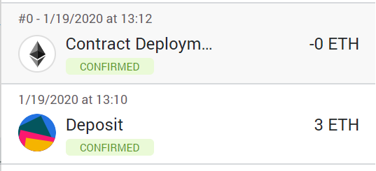

# Week 20 HW - 3 Way Equity Split Contract

* Name: *Vinay Kakuru*
* Assignment: *Solidity - Week 20*
* Summary: *Purpose of this assignment is to create a custom contrat in Solidity to split a equity value across 3 addresses*

### Confirmation of Contract Deployment https://kovan.etherscan.io/address/0x09dc185b1abbb191b7b525dcf16ac5904d5427f2

## My Steps and Screen-Shots

1) Get Kovan Test Ether from Faucet 
    ```
    https://gitter.im/kovan-testnet/faucet#
    ```
    Got 3 test Ether from Faucet
    

2) Compile threeTierSplit.sol on Remix
   

3) Deploy contract using 3 address from Ganche
   

4) Show the Deployed Transaction on Kovan Test Network
   
   
### Contract# 0x09DC185b1Abbb191b7b525dCf16AC5904d5427f2
### Account#  0xCA35b7d915458EF540aDe6068dFe2F44E8fa733c
